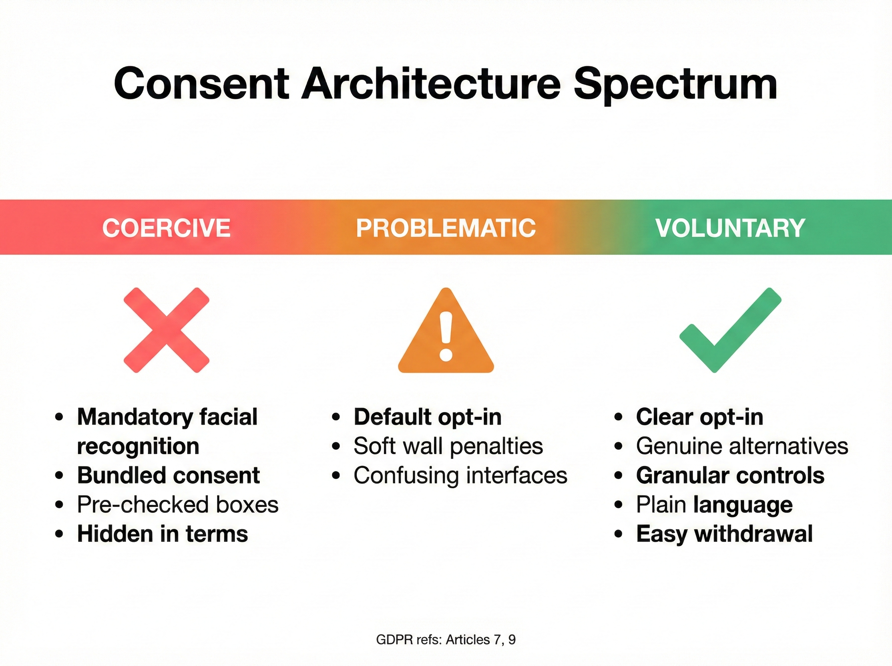
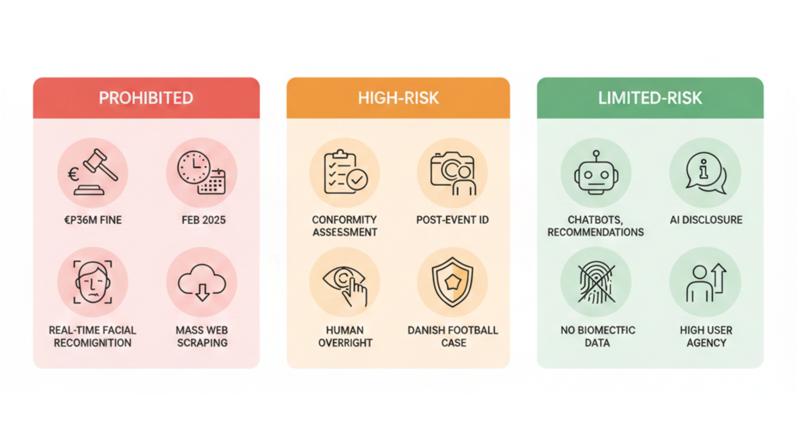

# Question 4: Surveillance Ethics and Privacy Risks

> **With the use of AI for real-time crowd movement analysis, facial recognition, and sentiment tracking, what are the primary ethical and data privacy risks festival organizers must address to use these tools for security and safety responsibly?**

---

# Narrative

**Target:** 1,800-2,000 words

Festival AI surveillance faces three critical risks: covert deployment violates consent requirements, regulatory non-compliance triggers €200,000+ fines, and algorithmic bias creates discriminatory harm. Spain fined two organizations €1.2 million combined for biometric violations in 2024. Over 40 festivals pledged never to use facial recognition after artist campaigns. The responsible path exists—Paris 2024 demonstrated effective crowd monitoring without facial identification—but proportionality must be documented, not assumed.

**This narrative covers five points:**

- **Risk 1: Covert Surveillance** — Taylor Swift and MSG deployed facial recognition without notice, triggering ACLU condemnation and legislative prohibition
- **Risk 2: Regulatory Violations** — GSMA and Osasuna faced €200,000+ fines for inadequate DPIA despite optional systems
- **Risk 3: Algorithmic Bias** — NIST found 10-100x higher false positive rates for minorities, seven wrongful arrests documented
- **Risk 4: Proportionality Framework** — Denmark approved facial recognition for football but denied concerts, establishing the "Concerts ≠ Football" principle
- **Risk 5: Responsible Implementation** — Paris 2024 and regulatory requirements provide frameworks for privacy-respecting AI

---

# When Security Becomes Intrusion

December 2024: Spain fined Club Atlético Osasuna €200,000 and ordered deletion of all biometric data. Same month, Denmark approved facial recognition at FC Copenhagen's stadium for football—but denied it for concerts at the same venue. The principle: biometric surveillance isn't categorically legal or illegal. It depends on proportionality.

Over 40 festivals—Bonnaroo, Lollapaloola, Electric Forest—pledged never to use facial recognition after sustained artist campaigns. Red Rocks abandoned Amazon palm-scanning after 300+ artists protested. When surveillance feels invasive, festivals face artist boycotts, attendee backlash, and seven-figure fines.

---

*Figure 4.1: Privacy vs. Safety Trade-Off Matrix - When biometric surveillance is appropriate, conditional, constrained, or illegal*

---

## Risk 1: Covert Surveillance Without Consent

**Taylor Swift Rose Bowl (2018)**

May 2018. Sixty thousand fans walked past kiosks showing rehearsal footage. What they didn't know: each screen was scanning their faces, cross-referencing against a database of Swift's known stalkers. No signage. No opt-in. No way to decline.

When Rolling Stone broke the story, the ACLU condemned it as "unacceptable surveillance." Regulators still cite the incident in guidance on covert biometric processing. Had this occurred in the EU, Swift's team would face GDPR violations carrying €20 million or 4% of global turnover. Under California CCPA, biometric data is "sensitive personal information" requiring notice and opt-out rights.

**Madison Square Garden (2022-2024)**

MSG Entertainment deployed facial recognition to identify attorneys from firms suing the company—then ejected them mid-event. An attorney celebrating her daughter's birthday was removed. A lawyer chaperoning a Girl Scout troop was escorted out.

But 100+ artists announced boycotts by July 2023. The New York Legislature banned the practice in June 2024. Legal doesn't mean socially acceptable.

---

## Risk 2: Regulatory Violations and €200,000 Fines

**Mobile World Congress 2021**

The GSMA deployed facial recognition for conference entry. It was optional—43% opted in, 57% used manual ID check. Spain's data protection authority fined them €200,000 anyway.

The violation: Article 35 GDPR requires a Data Protection Impact Assessment before deploying biometric systems. The GSMA submitted one, but regulators called it "merely nominal"—it failed to examine necessity, proportionality, risks, or safeguards. The lesson: opt-in consent doesn't equal GDPR compliance. Rigorous DPIAs cost €20,000-€80,000 but mitigate €200,000+ fines.

**Club Atlético Osasuna (December 2024)**

Spain fined Osasuna €200,000, ordered deletion of all biometric data, and prohibited further facial recognition use. The proportionality failure: "Marginal benefits did not justify the processing" when QR codes already enabled efficient access. Convenience alone isn't sufficient justification. Same year, La Liga received a €1,000,000 fine for biometric identification without proper DPIA.

---

## Risk 3: Algorithmic Bias and Discriminatory Harm

**NIST Test (2019)**

The National Institute of Standards and Technology evaluated 189 commercial facial recognition algorithms. False positive rates run 10-100 times higher for Asian and African American faces compared to Caucasian faces. Women are misidentified more than men across most systems.

**Seven Wrongful Arrests**

Robert Williams was detained for 30 hours in Detroit for shoplifting he didn't commit. Porcha Woodruff was eight months pregnant when Detroit police arrested her for carjacking. Randal Reid was arrested in Georgia for crimes committed in Louisiana—detained for six days despite being in another state. The pattern: six of seven documented wrongful arrests involve Black individuals.

For festivals, a 1% false positive rate at a 50,000-person event means 500 innocent attendees flagged—creating civil liability, reputational damage, and BIPA violations carrying $1,000-5,000 per person. You can't change your face. Biostar 2 exposed 27.8 million biometric records in 2019. Under Illinois BIPA, a breach affecting 10,000 attendees generates $10-50 million in statutory damages.

---

## Danish DPA Test: Concerts ≠ Football

December 2024. FC Copenhagen proposed facial recognition at Parken Stadium for both football and concerts. Denmark approved it for football. Denied it for concerts.

The football rationale: documented hooliganism, banned individuals on police suspension lists, previous violent incidents, substantial public interest. The concert rationale: no documented security problems, no violence history, no banned lists. QR codes already provide adequate access control.

The principle: biometric surveillance must be proportionate to documented threats, not merely convenient. Festivals can't claim "general security." They must show specific, substantial risks that less intrusive measures can't address.

Four questions test proportionality. First: Is there documented incident history? If "we just want faster entry," proportionality likely fails. Second: Are less intrusive alternatives available? RFID wristbands, mobile tickets, security personnel exist—if they work, proportionality fails. Third: What's the false positive rate? At 50,000 attendees with 1% error, that's 500 wrongful ejections. Fourth: Can you demonstrate GDPR Article 35 compliance? Rigorous DPIAs cost €20,000-€80,000. GSMA and Osasuna each paid €200,000 for inadequate compliance.

---

## Responsible Surveillance: The Paris 2024 Model

Paris deployed AI-powered crowd monitoring across 35 Olympics venues using Cityvision software. The system explicitly excluded facial recognition. The capabilities: crowd surge detection, abandoned object identification, weapon detection, fire and smoke detection, anonymized density analysis. The system knows "100 people in this zone," not "John Smith is in this zone."

Why it works: proportionate to mega-event security needs, privacy-by-design excluded biometric identification, transparent governance with CNIL oversight, specific authorization expiring March 31, 2025—not perpetual surveillance. Festivals can implement AI crowd density monitoring without biometric identification. Paris 2024 demonstrates feasibility.

---

## Why Sports Succeeded, Festivals Failed

Cleveland Browns deployed Wicket facial recognition—over 50% of season ticket holders enrolled, entry time dropped to two seconds. Why it worked: repeat attendance (eight+ games) justifies one-time enrollment, and NFL stadiums have documented violence.

Over 40 festivals rejected the same technology. Tom Morello, Amanda Palmer, and 300+ musicians signed opposition letters. Live Nation and AEG functionally pledged not to deploy.

The difference: one-time festival attendance offers minimal ROI, most festivals lack documented violence, and festival culture values spontaneity over throughput.

---

*Figure 4.2: Consent Architecture Spectrum - GDPR-compliant consent patterns from coercive (illegal) to voluntary (compliant)*

---

## Regulatory Landscape

**GDPR (EU/UK)**

Biometric data is "special category" under Article 9, requiring explicit consent or substantial public interest. For private festivals, explicit consent requires genuine alternatives equally accessible, withdrawal as easy as granting consent, no power imbalance. Article 35 mandates DPIAs before deployment. Violations draw €200,000+ fines (GSMA, Osasuna). Unlawful processing carries penalties up to €20 million or 4% of global turnover.

**BIPA (Illinois)**

Illinois enacted the strictest US biometric law: written consent required before collection, disclosure of purpose and retention schedule mandatory, private right of action allowing individuals to sue directly, statutory damages of $1,000-$5,000 per violation. Meta settled for $1.375 billion in 2024. Google settled for $100 million in 2023. Lollapaloola operates in Illinois—any biometric deployment without BIPA compliance creates class action risk.

**EU AI Act (Effective February 2, 2025)**

The Act bans real-time biometric identification in public spaces for private entities. Narrow law enforcement exceptions require judicial authorization. Post-event biometric identification and AI affecting access to services are high-risk, requiring conformity assessment. Prohibited use carries fines of €35 million or 7% of global turnover. For festivals: real-time facial recognition at entry is banned. Post-event analysis is high-risk and requires conformity assessment.

---

*Figure 4.3: EU AI Act Risk Classification - Three-tier framework: prohibited, high-risk, limited-risk*

---

## If You Must Deploy Surveillance

Before deployment, complete a rigorous DPIA (€20,000-€80,000 consulting). Consult your Data Protection Officer. Verify legal basis under GDPR Article 9(2) or BIPA. Check EU AI Act prohibitions. Assess proportionality using the Danish framework.

On the technical side, test for demographic bias using NIST-style evaluations. Establish false positive and negative rates with confidence intervals. Implement restricted capture zones with no passive scanning. Build fallback systems. Encrypt biometric templates, never store raw images.

For consent architecture, provide genuine alternative entry that's equally accessible. Design symmetry in choice—opting out should be as easy as opting in. Use progressive disclosure with essential information upfront. Avoid dark patterns like hidden consents or automatic resets. Enable simple withdrawal with data deletion.

Governance requires limiting retention periods to delete data after the event or season. Restrict access to security teams only with audit trails. Prohibit function creep—no repurposing data without new consent. Plan breach response procedures for 72-hour GDPR notification. Issue annual transparency reports for large-scale deployments.

---

*Figure 4.4: GDPR Compliance Decision Tree - Five checkpoints for evaluating biometric system legality*

---

## The Bottom Line

Every festival faces a choice Spanish regulators priced at €200,000: deploy responsibly or face consequences.

Over 40 festivals chose rejection over reputational risk. Denmark denied concerts while approving football. Paris 2024 demonstrated effective crowd monitoring without facial recognition. €200,000+ fines are routine. Artist boycotts numbering 100+ create existential threats.

The responsible path exists: AI crowd density monitoring (fluid dynamics, anonymous sensors), RFID wristbands (Tomorrowland), trained security personnel. Biometric surveillance isn't impossible—it's rarely proportionate. Without documented security incidents like hooliganism, regulators apply the Danish standard: Concerts ≠ Football.

For students and professionals: you'll encounter pressure to deploy surveillance AI. The question is whether you'll have frameworks to say "no" when inappropriate and courage to advocate for privacy-respecting alternatives. €200,000 fines, artist boycotts, and regulatory denials send a clear message: convenience isn't sufficient justification. Festivals that learn this avoid consequences. Those that don't learn expensively.

---

**Sources:**

- [ACLU: The problem with using face recognition on fans at a Taylor Swift concert](https://www.aclu.org/news/privacy-technology/problem-using-face-recognition-fans-taylor-swift)
- [ACLU: Williams v. City of Detroit - Face recognition false arrest](https://www.aclu.org/cases/williams-v-city-of-detroit-face-recognition-false-arrest)
- [AEPD (Spain): La Liga €1,000,000 fine for biometric processing without DPIA - Decision EXP202315637](https://gdprhub.eu/index.php?title=AEPD_(Spain)_-_EXP202315637)
- [Big Brother Watch: Stop facial recognition campaign report](https://bigbrotherwatch.org.uk/campaigns/stop-facial-recognition/report/)
- [Büchi, M., Festic, N., & Latzer, M. (2022). The chilling effects of digital dataveillance. Big Data & Society](https://journals.sagepub.com/doi/10.1177/20539517211065368)
- [CBS News: Madison Square Garden faces scrutiny over facial recognition technology](https://www.cbsnews.com/news/madison-square-garden-face-recognition-illegal-new-york-attorney-general-letitia-james/)
- [Center for Democracy and Technology: EU AI Act brief - Privacy and surveillance](https://cdt.org/insights/eu-ai-act-brief-pt-2-privacy-surveillance/)
- [Danish Data Protection Authority: Decision 2024-51-0012 on FC Copenhagen facial recognition](https://gdprhub.eu/index.php?title=Datatilsynet_(Denmark)_-_2024-51-0012)
- [ECNL: Hungary's new biometric surveillance laws violate AI Act](https://ecnl.org/news/hungarys-new-biometric-surveillance-laws-violate-ai-act)
- [Electronic Frontier Foundation: About Face - EFF's work on face recognition](https://www.eff.org/aboutface)
- [European Parliament: EU AI Act - First regulation on artificial intelligence](https://www.europarl.europa.eu/topics/en/article/20230601STO93804/eu-ai-act-first-regulation-on-artificial-intelligence)
- [Fight for the Future: Ban facial recognition from festivals](https://festivals.banfacialrecognition.com/)
- [GDPR Article 9: Processing of special categories of personal data](https://gdpr-info.eu/art-9-gdpr/)
- [National Academies of Sciences: Facial recognition technology - Current capabilities, future prospects, and governance](https://nap.nationalacademies.org/read/27397/chapter/5)
- [National Institute of Standards and Technology (2019): Face Recognition Vendor Test Part 3 - Demographic Effects](https://nvlpubs.nist.gov/nistpubs/ir/2019/NIST.IR.8280.pdf)
- [New York Attorney General: Attorney General James seeks information from Madison Square Garden regarding use of facial recognition technology](https://ag.ny.gov/press-release/2023/attorney-general-james-seeks-information-madison-square-garden-regarding-use)
- [New York State Bar Association: Privacy vs. security - The legal implications of using facial recognition technology at entertainment venues](https://nysba.org/privacy-vs-security-the-legal-implications-of-using-facial-recognition-technology-at-entertainment-venues/)
- [NPR: Facial recognition technology at MSG has sparked new concerns](https://www.npr.org/2023/01/21/1150289272/facial-recognition-technology-madison-square-garden-law-new-york)
- [Pew Research Center (2022): Public more likely to see facial recognition use by police as good rather than bad for society](https://www.pewresearch.org/internet/2022/03/17/public-more-likely-to-see-facial-recognition-use-by-police-as-good-rather-than-bad-for-society/)
- [Privacy International: Blank space - Why Taylor Swift doing facial recognition is a bad idea](https://privacyinternational.org/news-analysis/2547/blank-space-why-taylor-swift-doing-facial-recognition-bad-idea)
- [Rolling Stone: Taylor Swift used facial recognition at concert to identify stalkers](https://www.rollingstone.com/music/music-news/taylor-swift-facial-recognition-concerts-768741/)
- [Stadium Tech Report: Wicket's facial authentication technology a ticket to success for Cleveland Browns](https://stadiumtechreport.com/feature/wickets-facial-authentication-technology-a-ticket-to-success-for-cleveland-browns/)
- [UNESCO: Recommendation on the Ethics of Artificial Intelligence](https://www.unesco.org/en/articles/recommendation-ethics-artificial-intelligence)
