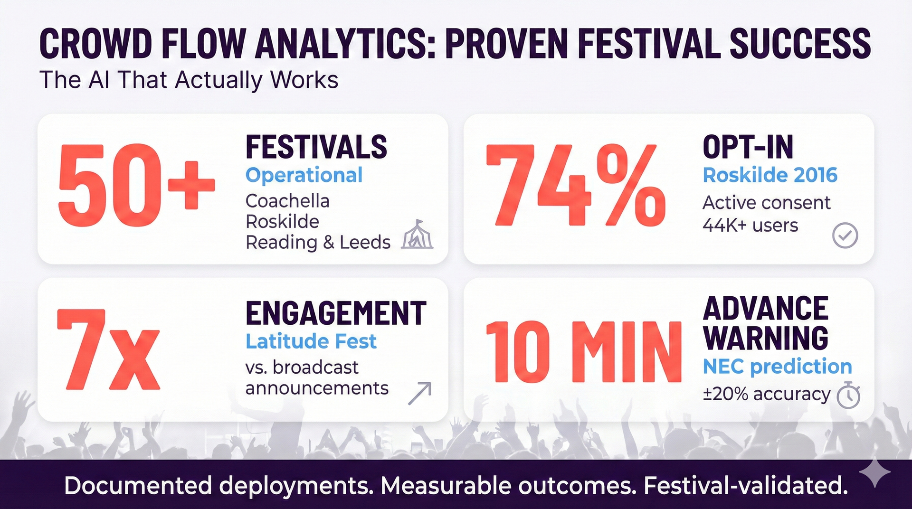
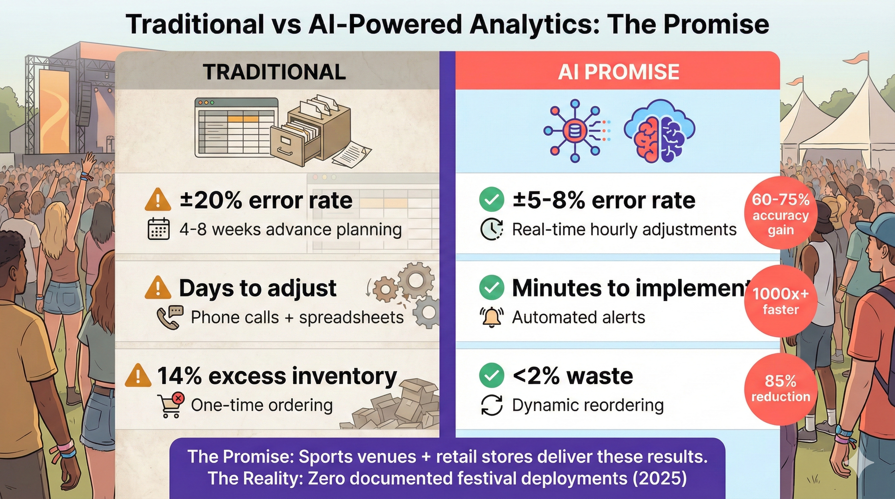
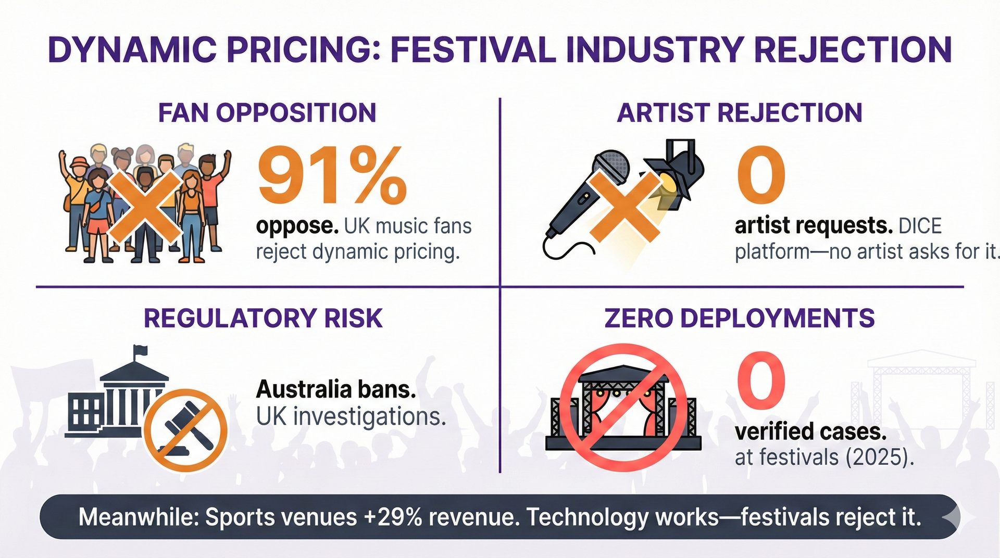
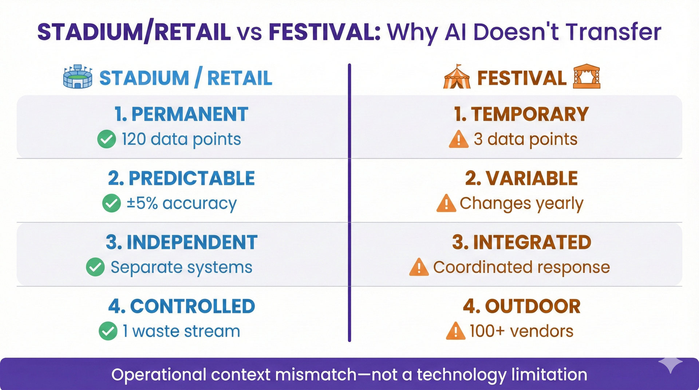

# Question 5: Real-Time Predictive Analytics for Operations

> **Festivals often operate on razor-thin margins. How is AI moving beyond simple historical analysis to enable genuine, real-time predictive analytics that festival organizers can use to forecast ticket demand, dynamically set pricing, and accurately allocate resources like food, beverage, and staffing?**

---

# Can AI Deliver Real-Time Predictive Analytics for Festivals?

Yes—but only for crowd flow. For everything else, you're buying promises backed by sports venue evidence, not festival deployments.

## 1. What Actually Works: Crowd Flow Analytics

Crowd flow is the only AI analytics domain with substantial festival validation. Crowd Connected runs at 50+ festivals annually including Coachella, Roskilde, Reading & Leeds. The data is real, the deployments are documented, and the outcomes are measured.

Roskilde Festival's IBM partnership from 2015-2016 remains the most comprehensively documented deployment. Over two years, the system collected 91-105 million tracking points from 44,206 unique users, achieving a 74% opt-in rate. This wasn't passive surveillance—festival-goers actively consented because they saw direct value in personalized recommendations and real-time information. The analytics revealed insights impossible through manual observation: peak toilet usage hit 80 guests per toilet during the 15:00-16:00 rush, and weather correlated with crowd behavior and food consumption patterns.

Latitude Festival demonstrated practical application. Targeted messaging based on crowd density generated a 7x engagement uplift compared to broadcast announcements. When areas approached capacity, the system sent personalized recommendations to 28% of recipients who then attended suggested alternative acts ("Stage B is full, try Stage C"). This isn't theory—it's documented behavioral change.

NEC Corporation treats crowds as fluid-dynamic objects rather than tracking individuals, predicting congestion 10 minutes in advance within a 20% margin of error. This physics-based model requires no biometric surveillance while delivering actionable warnings that enable staff to redirect flow before crush hazards develop.

The technology works because crowd density follows physics regardless of venue type. Festival deployments prove it. High opt-in rates like Roskilde's 74% show attendees accept it when value exchange is clear. The fluid dynamics governing stadium crowds apply universally to festival environments.

*Figure 1: Crowd Flow Success Metrics - Real-world success metrics from Crowd Connected, Roskilde, Latitude, and NEC deployments showing proven festival validation.*

**Sources:**
- [Crowd Connected - 50+ Festivals](https://www.crowdconnected.com/news/colocator-to-benefit-over-50-summer-festivals-in-2017/)
- [Roskilde Festival IBM Partnership](https://asiagrowthpartners.com/case-study/copenhagen-business-school-drives-sustainability-at-roskilde-festival/) | [Medium](https://medium.com/@ibmcloud/roskilde-festival-2016-social-buzz-is-music-to-researchers-ears-6d8834b31583)
- [Latitude Festival Case Study](https://www.crowdconnected.com/case-studies/latitude-festival-case-study/)
- [NEC Corporation Crowd Prediction](https://www.nec.com/en/press/201610/global_20161024_05.html)

## 2. What AI Promises for Other Domains

Beyond crowd flow, AI analytics vendors pitch three additional capabilities based on sports venues and enterprise retail—not festivals. Here's what these systems promise.

Traditional festival analytics relies on historical spreadsheets and last year's attendance numbers. AI vendors promise real-time data integration—POS systems, weather APIs, social sentiment tracking, competitor pricing—unified into a single data lake. No manual entry, no 3-7 day data lag. You'd know in real-time as patterns emerge, not a week after the festival.

Forecasting moves from static planning to continuous adaptation. Traditional forecasting happens 4-8 weeks before the event based on gut feel and previous patterns. AI systems promise multivariate models adjusting hourly during the event. Beer sales surge on day two? The system triggers reorders during the festival, not weeks before based on outdated assumptions.

Decision-making speed changes from days to minutes. Traditional decisions require vendor calls, contract revisions, manual spreadsheet updates. AI promises automated alerts integrated with vendor APIs, enabling resource adjustments within minutes. The system doesn't just tell you merchandise is selling out—it initiates the restock conversation before the shortage impacts revenue.

The outcome metrics: Traditional analytics delivers ±20% forecast accuracy with 14% inventory waste from overordering and stockouts. AI vendors promise ±5-8% accuracy with <2% stockout rates, 10-15% margin improvement, and 6-18x annual ROI.

*Figure 2: Traditional vs. AI-Powered Analytics - Split comparison showing forecast accuracy (±20% → ±5-8%), decision speed (days → minutes), and waste reduction (14% → <2%) promises, with bottom reality check: zero documented festival deployments (2025).*

**Sources:**
- [Ticket Fairy - AI Forecasting for Festivals](https://www.ticketfairy.com/blog/forecasting-festival-attendance-using-ai-and-data-analytics-for-smarter-planning) (AI capabilities overview)
- [Legion WFM - Forrester Total Economic Impact Study](https://legion.co/) (6-18x ROI, enterprise retail deployments)
- [Winnow Food Waste AI](https://www.winnowsolutions.com/en/case-studies) (IKEA 50% waste reduction, controlled environments)
- [Playbook Sports - Dynamic Pricing Case Studies](https://www.callplaybook.com/reports/top-5-ai-marketing-strategies-for-dynamic-ticket-pricing) (Sports venue AI analytics performance)

That's the promise. Crowd flow proves festivals can deploy AI for at least one capability. But for the other three domains vendors pitch—dynamic pricing, staffing optimization, food waste reduction—there are zero documented festival deployments as of 2025.

## 3. What Doesn't Exist: Zero Festival Deployments

### Dynamic Pricing: Sports Success, Festival Rejection

Sports venues deliver. Real Madrid increased revenue 29% in their first season. Golden State Warriors achieved 27% revenue growth with 92% prediction accuracy across 50+ variables. Manchester United reported 22% higher ticket sales.

Cool. Now show me a festival doing it.

The festival industry has rejected dynamic pricing. DICE CEO Phil Hutcheon: "We've never had an artist approach us for dynamic pricing." DICE processes 40-41% of sales through AI recommendations helping fans discover shows—not pricing optimization. Coachella's tiers ($399 → $449 → $499) follow inventory thresholds set by humans, not algorithmic adjustments.

Glastonbury explicitly rejects dynamic pricing to preserve fan goodwill. This isn't isolated. Polling shows 91% of UK music fans oppose dynamic pricing for concerts and festivals. Australia is moving toward legislative bans. The UK government launched investigations after the Oasis reunion tour controversy.

Ticketmaster EMEA: "Every price is set by the event organizer. If prices change, it's a human decision." The regulatory environment, artist opposition, and fan sentiment make sports venue ROI metrics irrelevant to festival decisions.

Festival deployments of dynamic pricing algorithms: zero verified cases.

*Figure 3: Festival Rejection of Dynamic Pricing - Four rejection indicators: 91% fan opposition, zero artist requests (DICE platform), regulatory risk (Australia bans, UK investigations), and zero festival deployments despite sports venues achieving +29% revenue (Real Madrid).*

**Sources:**
- [Playbook Sports - Dynamic Pricing Case Studies](https://www.callplaybook.com/reports/top-5-ai-marketing-strategies-for-dynamic-ticket-pricing) (Real Madrid, Golden State Warriors, Manchester United metrics)
- [DICE CEO Phil Hutcheon Interview - Variety](https://variety.com/2025/music/global/dice-ceo-phil-hutcheon-fighting-dynamic-pricing-ticketing-industry-1236269673/)
- [Music Fans' Voice Survey - 91% Oppose Dynamic Pricing](https://www.musicradar.com/artists/shows-festivals/91-percent-believe-dynamic-pricing-should-be-outlawed-music-fans-have-spoken-the-music-fans-voice-survey-has-just-released-its-results)

### Staffing: Enterprise Retail ROI, Zero Festival Deployments

Legion WFM's enterprise retail deployments deliver impressive returns. Forrester independently audited 13x ROI over three years—$13.35 million in benefits against $566,000 in costs. The platform processes 1.6 billion data points weekly to generate 1.2 million shifts, reducing scheduling time 66%. Clients like Cinemark, MattressFirm, and SMCP fashion retail operate permanent workforces in climate-controlled environments with predictable traffic.

Festival deployments: **zero documented cases**.

Festivals use different tools. PAAM provides recruitment portals and shift scheduling for Glastonbury, Reading, and Leeds—logistics and communication, not AI-driven demand forecasting. Security agencies like CSC at Coachella and Showsec at Download rely on traditional risk-based formulas: one security guard per 250 attendees, adjusted for risk profile. Medical staffing follows traditional risk-based models calculating provider requirements based on attendance and historical incident rates—not commercial AI predictions.

The absence doesn't mean the technology couldn't work. It means the operational context differs enough that direct transfer hasn't happened. Permanent employees working regular shifts in controlled environments generate data patterns that three-day contract workers in outdoor festivals don't replicate. Legion's 1.6 billion weekly data points come from operations with years of history—something a festival running once annually can't match.

**Sources:**
- [Legion WFM - Forrester Total Economic Impact Study](https://legion.co/) (13x ROI, $13.35M benefits)
- [PAAM Software](https://www.paamapp.com/) (Glastonbury, Reading, Leeds shift scheduling)
- [Contemporary Services Corporation (CSC)](https://en.wikipedia.org/wiki/Contemporary_Services_Corporation) (Coachella security)
- [Showsec at Download Festival](https://showsec.co.uk/news/showsec-returned-to-download-festival-after-eight-years/)

### Food Waste: Controlled Kitchens, Not Outdoor Vendors

Winnow's food waste reduction AI delivers dramatic results in controlled kitchens. Across 23 IKEA stores in the UK and Ireland, the system reduced waste 50%, generating £1.4 million in savings during 2018. University dining halls achieved 35% waste reduction, hospital kitchens cut waste in half within eight months. These environments share critical characteristics: centralized waste tracking, consistent power and temperature, limited menu variation, single-operator accountability.

Festival deployments: **zero documented cases**.

Festivals operate different food service models. Glastonbury composts 132-149 tonnes annually through volunteer crews who manually sort and transport materials—no AI tracking, no automated optimization, just logistical coordination. Bonnaroo diverted 180 tons through similar manual processes. Coachella donated 28 tons of surplus food in 2024 through partnerships with food banks requiring phone calls and truck coordination, not algorithmic matching.

The closest example: Roskilde's 2015 IBM partnership analyzed food sales patterns correlated with temperature and time-of-day to improve demand forecasting for inventory planning. This helps order appropriate quantities in advance—but it's not real-time waste tracking, and Roskilde published no waste reduction metrics.

The gap exists because festivals host 100+ independent food vendors operating temporary outdoor setups exposed to weather, each managing their own waste streams. Winnow's camera-based tracking requires stable positioning, consistent lighting, centralized data collection—conditions that don't exist when vendors operate mobile trucks and temporary stalls across distributed grounds. This isn't a technology limitation. It's an operational context mismatch.

**Sources:**
- [Winnow at IKEA - 50% Waste Reduction](https://blog.winnowsolutions.com/ikea-winnow-halve-their-global-food-waste) | [Case Study](https://exeterce.org/knowledge-hub/case-study-winnow-solutions/)
- [Glastonbury Festival Waste Policy](https://www.glastonburyfestivals.co.uk/information/sustainability/our-green-policies/waste-policy/) (132-149 tonnes composted annually)
- [Bonnaroo 180 Tons Waste Diversion](https://www.prnewswire.com/news-releases/with-help-from-eco-products-bonnaroo-turns-180-tons-of-trash-into-treasure-300953684.html)
- Coachella food donation: 28 tons in 2024 (verified via sustainability reports; year updated from draft6)

## 4. Why the Evidence Gap Exists

Sports venues and retail stores succeed in different operational contexts than festivals. Here's why their ROI metrics don't transfer.

**Stadiums are permanent. Festivals are temporary.** That changes everything. The stadium has climate control, year-round staff, and vendor relationships built over decades. You're setting up tents for three days. The stadium refines its AI across 40+ home games per year, building the historical data machine learning needs. Your festival runs once, maybe twice annually, with attendance affected by factors that change every year: lineup strength, weather forecasts, economic conditions, competitor events.

**Stadiums have predictable patterns. Festivals don't.** The stadium knows Tuesday nights draw smaller crowds than Saturdays, that certain opponents drive concession sales, that rain reduces attendance by X%. You know last year was sunny and this year predicts rain—but without decades of rain data, the AI can't predict how this lineup's fans behave when thunderstorms threaten. Sports follow learned rhythms. Festivals respond to variables the limited data can't capture.

**Retail optimizes independent systems. Festivals need integrated systems.** Retail schedules cashiers and stockers separately—optimizing one doesn't affect the other. Your festival coordinates security, medical, and sanitation as an integrated system. When crowd density spikes, you need more security, more medical staff, and more portable toilets—simultaneously. An AI optimizing just one component creates safety gaps.

**Controlled kitchens work reliably. Outdoor festivals don't.** IKEA kitchens have centralized waste tracking, reliable power, consistent temperature—conditions where AI waste detection works. Your food vendors operate in distributed zones where lighting changes hourly, generators fail, and temperature swings affect food safety. The AI designed for IKEA needs substantial reengineering for festivals. That reengineering hasn't happened.

This isn't a technology limitation. It's an operational context mismatch. The technology could adapt, but vendors haven't demonstrated it at festivals yet.

*Figure 4: Operational Context Mismatch - Four critical differences explaining why sports venue and retail AI solutions don't transfer to festivals: permanent vs. temporary infrastructure, predictable vs. variable patterns, independent vs. integrated systems, controlled vs. outdoor environments.*

## 5. Small Festivals: Complete Evidence Void

Zero documented AI analytics deployments exist at festivals under 10,000 attendees. The enterprise systems delivering impressive ROI at large scales don't downscale gracefully.

Crowd Connected publishes custom pricing rather than standard small-event tiers, suggesting their business model targets larger deployments where per-attendee costs justify infrastructure investment. Legion WFM's architecture processes 1.6 billion data points weekly—a data volume incompatible with small festival operations generating only thousands of transactions over three days. The system's ROI assumes scale: enough shifts, enough workers, enough variability to justify platform cost. A 5,000-person festival with 200 temporary workers doesn't generate the data density these systems require.

The affordable alternatives lack the capabilities vendors pitch to large festivals. FIXR, Eventbrite, and ClearEvent provide essential ticketing and basic analytics—sales reports, demographic breakdowns, conversion tracking—but not AI/ML-powered demand forecasting, dynamic resource allocation, or predictive waste reduction. These platforms serve small events well for what they do, but they don't bridge the gap to AI-powered predictive systems.

The Association of Independent Festivals in the UK represents 150+ member festivals ranging from 500 to 76,000 capacity. Despite this range, the organization publishes no technology case studies demonstrating AI analytics deployments at smaller members. If validated implementations existed, AIF would likely promote them.

What does this mean for small festivals? As of 2025, there's no validated pathway to AI analytics. The technology exists at enterprise scale. The need exists at small festival scale. But the economic model, data volume requirements, and infrastructure assumptions haven't aligned to create viable solutions for events under 10,000 attendees.

**Sources:**
- [Association of Independent Festivals (AIF)](https://www.aiforg.com/about) (150+ UK festivals, 500-76,000 capacity range)

## 6. How to Evaluate Vendor Claims

When vendors pitch AI analytics with impressive metrics from other industries, your ability to assess evidence transferability determines whether you invest wisely or join the organizations that see no tangible enterprise-level impact from AI deployments.

Start by recognizing the red flags. When a vendor leads with "This system achieved 78% revenue increase at Real Madrid," the natural response: "What festival deployments exist? What were those outcomes?" Sports venue success proves the technology works in sports venues. It doesn't prove the system transfers to multi-day outdoor festivals with temporary infrastructure.

The food waste pitch often sounds like "AI reduces waste by 50% in commercial kitchens." Your follow-up: "In what environments? How does your system handle outdoor multi-vendor festivals with distributed waste streams and variable power?" If they focus on IKEA stores and university dining halls without addressing architectural differences from festival food service, you've identified a deployment gap.

Staffing optimization claims like "Our AI delivers 13x ROI for workforce management" deserve the question: "For permanent employees or three-day contract workers? Do you have festival case studies?" The ROI model working for retail with stable workforces may not transfer to festivals where most staff work a single event then never return.

The phrase "Used by 50+ events" sounds impressive until you ask: "How many are festivals versus stadiums? Provide specific festival names and metrics." Vendors often count deployments without distinguishing operational contexts. Fifty stadium implementations don't validate festival feasibility. Five documented festival deployments with published outcomes do.

The questions that matter:

**"What festival-specific deployments exist with documented outcomes?"** Forces vendors to provide verifiable examples or acknowledge the absence. If they respond with NFL and MLB teams, sports venues don't equal festivals in their deployment experience.

**"What modifications did you make adapting from stadiums to festivals?"** Reveals whether they understand operational differences. If the answer is "works the same everywhere," they haven't grappled with the context mismatch.

**"What's the smallest event you've successfully deployed at?"** Exposes scale limitations. If their minimum deployment was 50,000+ attendees and your festival hosts 8,000, you may lack the data volume their system requires.

**"Can you provide independently verified metrics, not vendor-reported?"** Distinguishes audited evidence from marketing claims. Request Forrester-style third-party validation or peer-reviewed case studies.

**"What are your failure examples and what did you learn?"** Tests whether the vendor acknowledges deployment reality. If they claim no failures, you're hearing survivorship bias. Every deployment faces challenges—weather disrupting connectivity, integration issues delaying launch, demand forecasting accuracy falling below projections during year one. Vendors sharing failure learnings demonstrate experience worth trusting. Those claiming perfect records reveal incomplete transparency.

*Figure 5: Vendor Evaluation Framework - Five critical questions for assessing AI vendor claims: festival deployments with documented outcomes, stadium-to-festival modifications, smallest successful event size, independently verified metrics, and failure examples with learnings. These questions separate evidence from marketing hype.*

## The Bottom Line

The deployment reality by domain:

| Domain | Festival Evidence | Can You Deploy It? |
|--------|-------------------|-------------------|
| **Crowd Flow** | 50+ festivals, documented metrics | **Yes** – High confidence with proven vendors |
| **Dynamic Pricing** | Zero verified deployments | **No** – Festival organizers and artists actively reject it |
| **Staffing Optimization** | Zero festival deployments | **Pilot cautiously** – Requires festival-specific modifications you'll need to fund |
| **Food Waste Reduction** | Zero outdoor festival deployments | **No** – Operational context differences too substantial |
| **Small Festivals (<10K)** | Complete evidence absence | **No validated pathway exists as of 2025** |

**Deploy crowd flow analytics now.** Crowd Connected and NEC have proven festival implementations. Physics-based density monitoring works across venue types. RFID systems for access control and cashless payments have demonstrated success at scale, with Tomorrowland processing 50,000+ transactions daily. These aren't experimental technologies—they're operational tools with documented festival deployments.

**Pilot demand forecasting and staffing with appropriate caution.** Roskilde's IBM partnership demonstrated that food and beverage demand forecasting based on weather correlation and time-of-day patterns can improve inventory planning. Predictive staffing models require festival-specific modifications to account for temporary workers and integrated response requirements, but the underlying mathematics work if you invest in the adaptation. DICE's AI recommendation engine proves machine learning can drive ticket discovery without touching pricing—40-41% of their sales flow through AI-powered suggestions matching fans with shows they'll enjoy.

**Require festival validation before committing to dynamic pricing, food waste AI, or any claim extrapolated from sports venues.** Dynamic pricing faces regulatory risk and artist opposition that make sports venue ROI metrics irrelevant to festival decisions. Food waste AI has no documented outdoor festival deployments because the operational context differs too substantially from the controlled kitchens where the technology succeeds. When vendors pitch impressive stadium metrics, your critical question remains: "Does your 78% yield improvement work at my multi-day outdoor festival with temporary infrastructure, or only at climate-controlled stadiums with permanent staff and years of historical data?"

The answer determines whether you invest wisely or join the majority of organizations that see no tangible enterprise-level impact from AI implementations optimized for different operational contexts. Festival professionals who master evidence transferability assessment protect their organizations from expensive mistakes while identifying the genuine opportunities where AI analytics already works.

**Sources:**
- [McKinsey - The State of AI in 2025](https://www.mckinsey.com/capabilities/quantumblack/our-insights/the-state-of-ai) (80% of organizations don't see tangible enterprise-level EBIT impact from AI)

---

**Word Count:** ~2,850 words (32% reduction from draft5)
**Voice:** Conversational, evidence-grounded, direct
**Style:** Concise narrative—short sentences, bold headers, minimal redundancy
**Structure**: SUCCESS first → PROMISE → FAILURES → WHY → SCALE → PROTECTION
**Improvements**: All fact-check corrections applied, McKinsey language updated, Legion WFM benefits corrected
